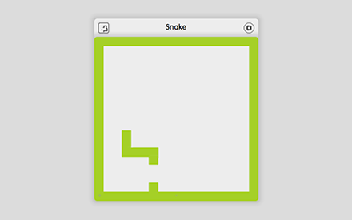
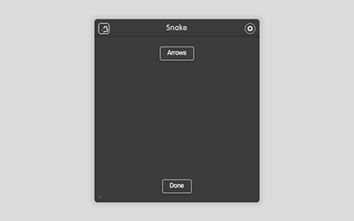
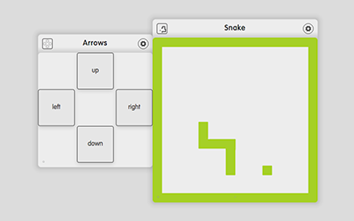
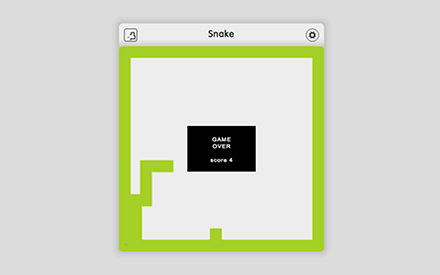

# Snake

## Screenshots

## Description

Play the classic game Snake with the up, down, left, right arrows on the keyboard. If you are playing on a touch screen, turn Snake to its back, press on the button 'Arrows' and turn Snake to its front with the 'Done' button. Dock the Arrows dizmo to Snake. Now press up, down, left, right on the docked Arrows to control Snake. To restart Snake, press on 'GAME OVER'.

## What is new in V0.1

* Build the game Snake.
* Add help.

## Additional information

Developer: dizmo AG
Contact: support@dizmo.com
Website: [www.dizmo.com](https://www.dizmo.com)
